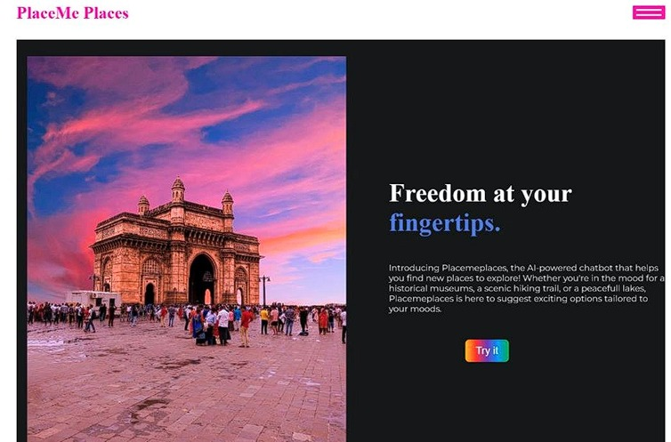
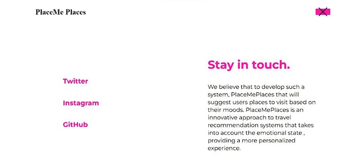
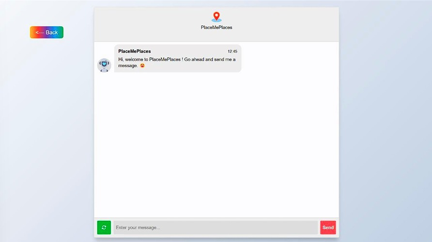
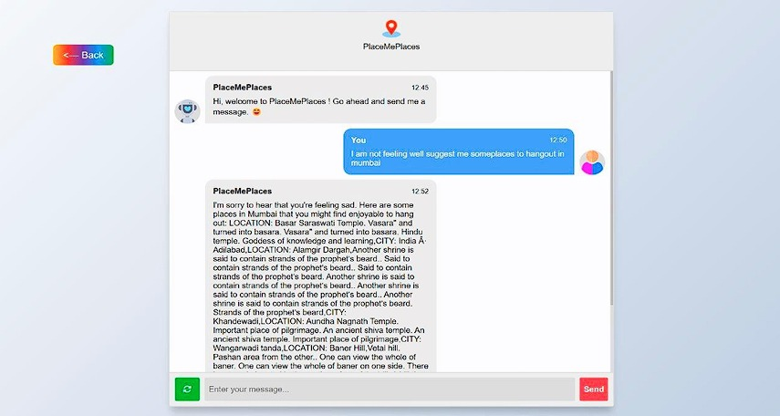

# PlaceME Places

**PlaceME Places** is an AI-powered travel recommendation web application that suggests locations based on a user's mood and preferences. It is designed to provide personalized travel experiences, particularly for introverts and wanderers who seek meaningful recommendations without relying on generic travel guides or stranger suggestions.

## 🌟 Features

- 🧠 **Sentiment Analysis:** Utilizes an LSTM model to analyze user mood based on input.
- 🗺️ **Place Recommendation:** Suggests locations from a curated dataset scraped from Trip.com and Wikipedia.
- 🤖 **Natural Language Understanding:** BERT-based Question Answering model generates human-like descriptions of the recommended places.
- 💬 **Interactive Web Interface:** Chat-style interface built using Flask, HTML, and CSS.
- ♻️ **Rewrite Prompt Option:** Allows users to regenerate recommendations if not satisfied.

## 📸 Demo

### Home Page


### About Page


### Input Prompt


### Output Recommendation


## 🧱 Tech Stack

- **Frontend:** HTML, CSS, JavaScript
- **Backend:** Python, Flask
- **AI Models:**
  - LSTM (Sentiment Analysis)
  - BERT (Question Answering)
- **Libraries:** BeautifulSoup, TensorFlow/Keras, Transformers (Hugging Face)

## 🧰 Installation

1. **Clone the repository**
   ```bash
   git clone https://github.com/Vaishnavi0805/PlaceME-Places.git
   ```

2. **Install dependencies**
   ```bash
   pip install -r requirements.txt
   ```

3. **Run the Flask server**
   ```bash
   python app.py
   ```

4. **Open the app**
   - Navigate to `http://localhost:5000/` in your browser.

## 📊 Dataset Sources

- Places data scraped from:
  - [Trip.com](https://www.trip.com/)
  - [Wikipedia](https://www.wikipedia.org/)
- Sentiment training dataset from:
  - [TripAdvisor Hotel Reviews on Kaggle](https://www.kaggle.com/datafiniti/trip-advisor-hotel-reviews)

## 🧪 Models & Training

- Preprocessing included:
  - Stopword removal
  - Lemmatization
  - Proper noun removal
  - Tokenization & padding
- Tried various classifiers: Naive Bayes, SVM, Decision Tree, RNN
- Best results achieved with LSTM
- BERT-based model answers predefined questions for place descriptions

## 📄 License

This project is licensed under the [MIT License](LICENSE).

